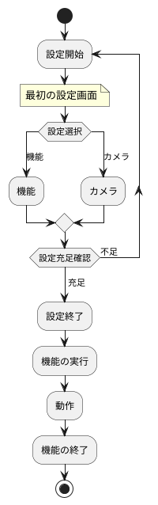
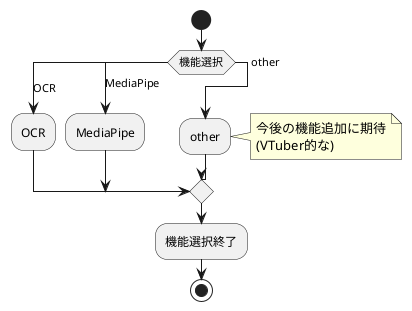
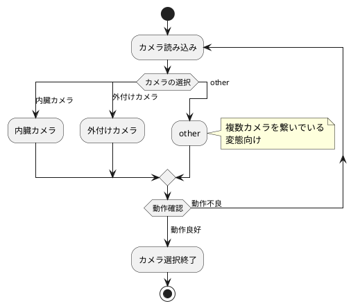
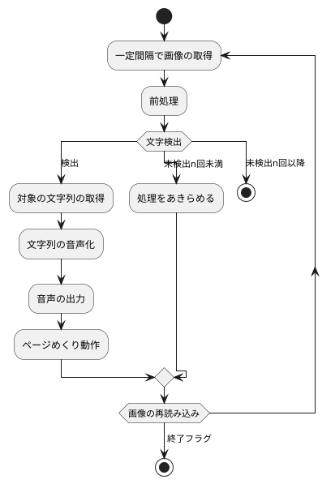

## システム要求仕様書

どうやって、機能を実装するかのアイデア

### 処理の流れ

全体のフロー

```plantuml
@startuml
start
repeat :設定開始;
note left: 最初の設定画面
switch (設定選択)
    case (機能)
        :機能;
    case (カメラ)
        :カメラ;
endswitch
repeat while (設定充足確認) is (不足)
->充足;
:設定終了;
:機能の実行;
:動作;
:機能の終了;
stop
@enduml
```

機能選択処理フロー

```plantuml
@startuml
start
switch (機能選択)
    case(OCR)
        :OCR;
    case (MediaPipe) 
        :MediaPipe;
    case (other)
        :other;
        note right: 今後の機能追加に期待\n(VTuber的な)
    endswitch
:機能選択終了;
stop
@enduml
```

カメラフロー

```plantuml
@startuml
start
repeat :カメラ読み込み;
switch (カメラの選択)
    case(内臓カメラ)
        :内臓カメラ;
    case (外付けカメラ) 
        :外付けカメラ;
    case (other)
        :other;
        note right:複数カメラを繋いでいる\n変態向け
endswitch
repeat while (動作確認) is (動作不良)
->動作良好;
:カメラ選択終了;
stop
@enduml
```

OCRの想定

```plantuml
@startuml
start
repeat :一定間隔で画像の取得;
:前処理;
switch(文字検出)
case(検出)
:対象の文字列の取得;
:文字列の音声化;
:音声の出力;
:ページめくり動作;
case(未検出n回未満)
:処理をあきらめる;
case(未検出n回以降)
stop
endswitch
repeat while (画像の再読み込み)
->終了フラグ;
stop

@enduml
```

上記の各アクティビティ図は[plantuml](https://plantuml.com/ja/activity-diagram-beta)を使って書きました。